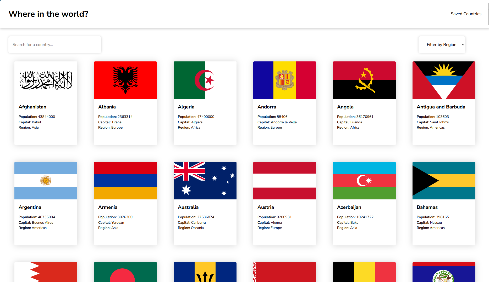
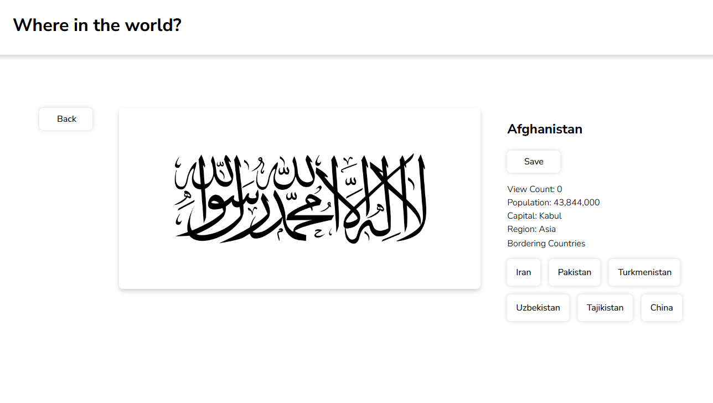
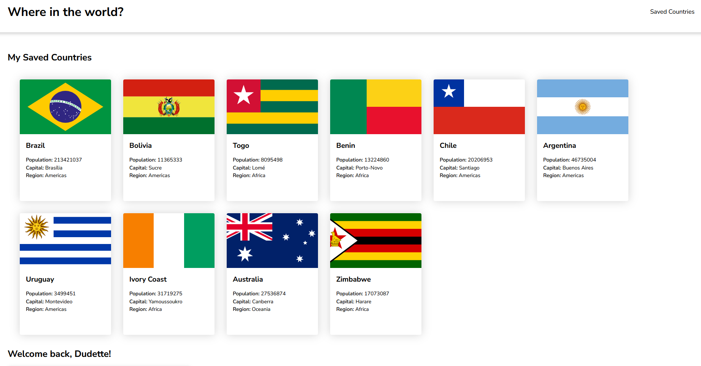
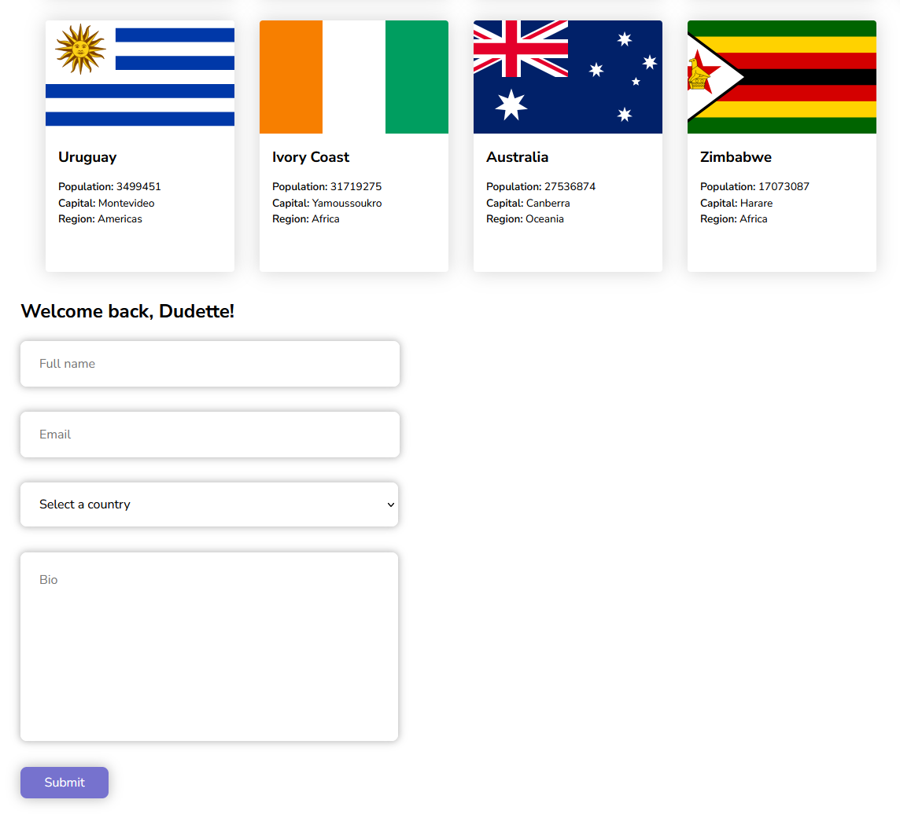

# 🏴Countries App 🏳️‍🌈

## What is this project?

This project is a culmination of everything I learned at AnnieCannons!

## 💻 Live Site

Here's the link to view the [live app](https://country-app-version-4.netlify.app/)

## 🖼️ Screenshots

 ### Home Page




### Details Page




### Saved Countries




### Saved Countries - Form



## ✨ Features

This is what you can do on the app: 
- Browse & search every country on the planet, with some info at a glance.
- Click a flag to gain more in depth knowledge as well as a list of bordering countries.
- Easily save a country at a button press for later quick access.
- Quick access to bordering countries from a country's detail page.
- Profile creation which includes your country of origin.

## 🛠️ Tech Stack

**Frontend**

- **Languages:** HTML, CSS, ,JS, JSX
- **Framework:** REACT, NEXT.js
- **Build Tool:** Vite
- **Deployment:** Netlify, GitHub Pages

**Server/API:** REST

- **Languages:** JS(Node.js)
- **Framework:** Express.js, Next.js
- **Deployment:** Render

**Database:** NEON

- **Languages:** PostgreSQL
- **Deployment:** NEON

## 🔹 API Documentation

These are the API endpoints I built: 
1. /add-one-user/
2. /get-newest-user/
3. /save-one-country/
4. /get-all-saved-countries/
5. /update-one-country-count/
6. /unsave-one-country/:country
7. /unsave-all-countries/
8. /reset-one-country-count/:country

Here's the link to the full API documentation: 

## 🗄️ Database Schema

Here’s the SQL I used to create my tables:  

```sql

CREATE TABLE country_counts (
	country_count_id	SERIAL PRIMARY KEY,
  	country_name		VARCHAR NOT NULL UNIQUE,
  	count				INTEGER NOT NULL
);

INSERT INTO country_counts (country_name, count)
VALUES	('Mexico', 1),
		('Cuba', 1),
        ('Brazil', 1),
        ('Ethiopia', 1);

CREATE TABLE saved_countries (
	saved_country_id	SERIAL PRIMARY KEY,
  	country_name		VARCHAR NOT NULL UNIQUE
);

INSERT INTO saved_countries (country_name)
VALUES	('Ethiopia'),
		('Brazil'),
        ('Mexico'),
        ('Skyrim'),
        ('Morrowind');

CREATE TABLE users(
	user_id 		SERIAL PRIMARY KEY,
  	name			VARCHAR NOT NULL,
  	country_name 	VARCHAR NOT NULL,
  	email			VARCHAR NOT NULL UNIQUE,
  	bio				VARCHAR
);

INSERT INTO users (name, country_name, email, bio)
VALUES 	('Enpie Sea', 'Skyrim', 'fyord@dragonborn.com', 'The one and only.'),
		('Kajit Kajit', 'Skyrim', 'kajit@haswares.com', 'Kajit has wares, if dragonborn have coin.'),
        ('Malacath of Morrowind', 'Morrowind', 'malacath@morrowind.com', 'The Daedric Prince of lies, deception and hypocrisy, the spurned and the ostracized, the keeper of the Sworn Oath, and the Bloody Curse.');

```

## 💭 Reflections

**What I learned:** I learned how our tech stack chains together, from database to the userpage.

**What I'm proud of:** I'm proud of my competent understanding of the subject matter and technologies we use to do everything.

**What challenged me:** Sometimes I would lose a trail. Meaning the path of our request and then the path back to the front page.

**Future ideas for how I'd continue building this project:** 
1. I haven't applied to much sorting. But I would like to. Maybe add some different filters.
2. Perhaps some more advanced animations.
3. Adding credentials to our form, and a login screen.

## 🙌 Credits & Shoutouts 

Shoutout to Arianna and Phil. Couldn't have done it without you. I would also like to mention that I used a lot of different youtubers to help me learn how to organize my projects and my roadmaps a bit better. I'd like to acknowledge all of my cohorts whom have, without knowing, challenged me to do better. 